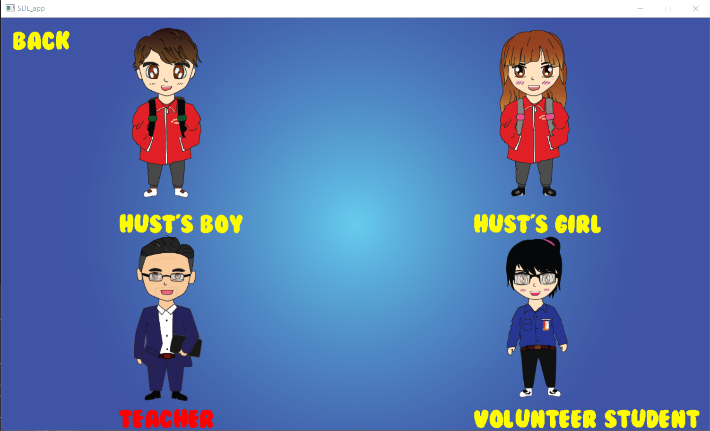

# ProjectGameCorona
Bài tập lớn môn kỹ thuật lập trình
## I)Giới thiệu chung
### 1)Đề tài
- Đề tài "Corona virus fighter game"
### 2)Ngôn ngữ lập trình và thư viện sử dụng
 - Ngôn ngữ lập trình  **C++** 
 - Ngoài các thư viện chuẩn của C++ như iostream, string,.. project còn sử dụng thư viện SDL.h, là thư viện hỗ trợ thiết lập game 2D
 - Tổng quan về thư viện SDL.h :
     -Simple DirectMedia Layer (SDL):là một thư viện đa nền tảng, bao gồm các API để thao tác với âm thanh, bàn phím, chuột, joystick, graphics hardware thông qua OpenGL và Direct3D.
     -Thư viện SDL được viết bằng C chuẩn, nhưng hỗ trợ tốt với C++ và nhiều ngôn ngữ lập trình khác như:C#,Java, Pascal, PHP, Python,...

     -SDL hỗ trợ trên các hệ điều hành như: Windows, Mac OS X, Linux, iOS và Android.
 
     -Các game sử dụng thư viện SDL như: Syberia II, 7 Grands Step, Secret Maryo Chronicles,…
- IDE hỗ trợ lập trình : **Visual Studio 2019**
- Các phần mềm hỗ trợ khác:
  - **Adobe Illustrator** 
  - **Adobe Photoshop**
- Các nguồn tài liệu và ảnh:
  - https://phattrienphanmem123az.com/
  - https://www.freepik.com/
## II)Cấu trúc chương trình
### 1) Các file Header
- *Test.h*: Gồm các hàm xử lý các thao tác load ảnh và tương tác với người dùng với game
- *Object.h*: Tạo ra 1 lớp đối tượng chung
- *Character.h*: Tạo ra lớp đối tượng nhân vật và các hàm xử lý nhân vật chơi
- *Threats.h*: Tạo ra lớp đối tượng vật rơi và các hàm xủ lý
- *TextGame.h*: Tạo ra đối tượng text và các thao tác load text lên giao diện game
- *File.h*: Gồm các hàm xử lý file *.txt*
### 2) Chương trình chính
## III) Cách chơi Game "BK Corona Fighter"
1) Khi khởi động Game, màn hình chính của Game sẽ là menu gồm các chức năng để người chơi lựa chọn


2) Chọn Chức năng bạn muốn
  - ```Chọn GameGuide để xem hướng dẫn chơi Game```
    
  - ```Chọn Highest Score để xem điểm cao nhất mà người chơi đã đạt được```
    
  - ```Chọn Character để lựa chọn nhân vật bạn ưa thích```
    
  - ``` Nhấn Play Game để chơi Game, khi đó màn hình chơi sẽ hiện ra```
    
  - ```Góc trái màn hình chơi hiển thị điểm của người chơi và số virus mà người đó dính phải, mỗi virus tương ứng với 1 dấu X. Nhiệm vụ của người chơi là di chuyển nhân vật qua trái hoặc qua phải bằng phím Left (Right) trên bàn phím để tránh virus rơi từ trên xuống cũng như nhận các vật phẩm là các "Kiến thức" rơi xuống. Mỗi kiến thức đạt được sẽ được cộng điểm theo cách tính điểm CPA tương ứng với loại kiến thức đó :)).Chú ý: Cứ mỗi 30 điểm thì tốc độ rơi của virus cũng như vật phẩm lại tăng 1 bậc```
  - ```Trong quá trình chơi, sẽ có những vật phẩm đặc biệt rơi xuống là Khẩu trang và Nước xát khuẩn. Nước xát khuẩn sẽ rửa sạch 2 virus dính trên cơ thể người chơi. Khẩu trang sẽ bảo vệ người chơi khỏi 2 virus. Khi nhân được khẩu trang, nhân vật sẽ đeo khẩu trang đến khi hết tác dụng, khẩu trang sẽ tự mất đi :))```
    
  - ``` Người chơi thua cuộc khi số virus dính trên người lớn hơn 3. ```
    
  -``` Nhấn Ok để thoát Game hoặc Cancel để quay lại màn hình chính ```
